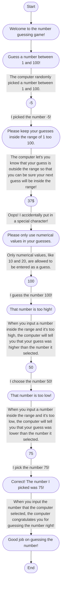

```mermaid

flowchart TD
Start([Start]) --> A([Welcome to the number guessing game!]) --> B([Guess a number between 1 and 100!]) -- The computer randomly picked a number between 1 and 100. --> C([-5]) -- I picked the number -5! --> D([Please keep your guesses inside the range of 1 too 100.]) -- The computer let's you know that your guess is outside the range so that you can be sure your next guess will be inside the range! --> E([37$]) -- Oops! I accidentally put in a special character! --> F([Please only use numerical values in your guesses.]) -- Only numerical values, like 10 and 20, are allowed to be entered as a guess. --> G([100]) -- I guess the number 100! --> H([That number is too high!]) -- When you input a number inside the range and it's too high, the computer will tell you that your guess was higher than the number it selected. --> I([50]) -- I choose the number 50! --> J([That number is too low!]) -- When you input a number inside the range and it's too low, the computer will tell you that your guess was lower than the number it selected. --> K([75]) -- I pick the number 75! --> L([Correct! The number I picked was 75!]) -- When you input the number that the computer selected, the computer congratulates you for guessing the number right! --> M([Good job on guessing the number!]) --> End([End])

```